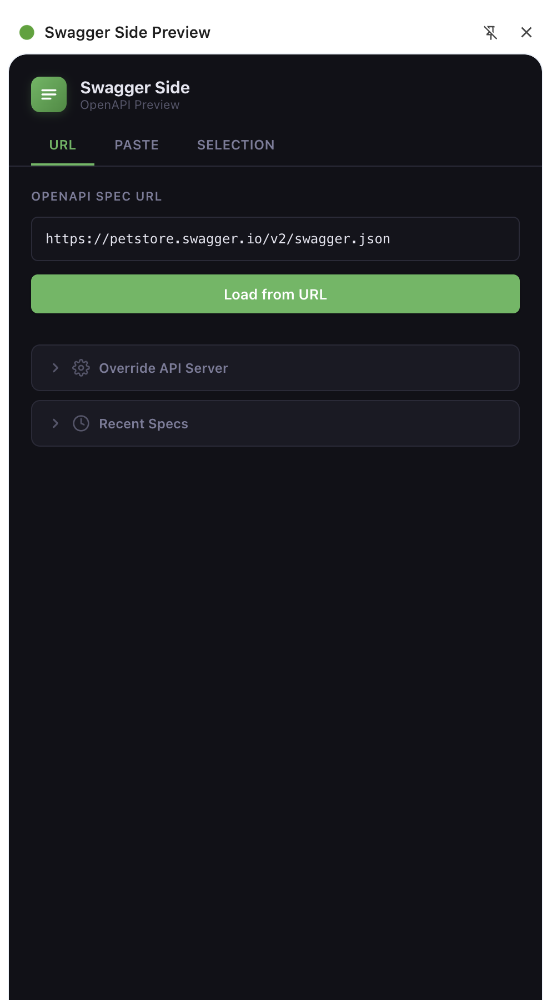
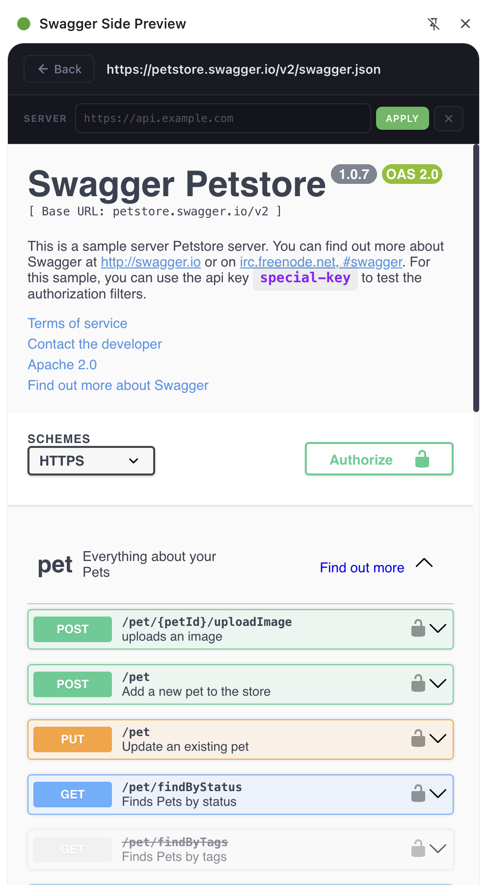

# Swagger Side Preview

A Chrome side panel extension to preview OpenAPI/Swagger docs in Swagger UI — without leaving your current tab.


## Features

- **Side panel** — renders Swagger UI in Chrome's native side panel, so your browsing stays uninterrupted
- **Three ways to load a spec:**
  - **URL** — paste a link to any hosted OpenAPI JSON file
  - **Paste** — drop raw JSON directly into the editor
  - **Selection** — select JSON on any webpage, right-click, and import it
- **Live server override** — change the API host on the fly from the rendered view
- **History** — recent specs are saved locally for quick access
- **Dark UI** — clean, minimal interface that stays out of your way

## Screenshots

| Input Panel | Swagger UI Viewer |
|---|---|
|  |  |

> Add your own screenshots to a `screenshots/` folder.

## Installation

### From the Chrome Web Store

1. Visit the [Chrome Web Store listing](#) *(link TBD after publishing)*
2. Click **Add to Chrome**
3. Click the extension icon in the toolbar to open the side panel

### From source (developer mode)

```bash
git clone https://github.com/YOUR_USERNAME/swagger-side-preview.git
cd swagger-side-preview
```

1. Open Chrome and go to `chrome://extensions`
2. Enable **Developer mode** (top-right toggle)
3. Click **Load unpacked**
4. Select the cloned folder
5. Click the extension icon in the toolbar to open the side panel

## Usage

### Load from URL

1. Open the side panel
2. Stay on the **URL** tab
3. Paste a spec URL (e.g. `https://petstore.swagger.io/v2/swagger.json`)
4. Click **Load from URL**

### Paste a spec

1. Switch to the **Paste** tab
2. Paste your OpenAPI JSON
3. Click **Render Spec**

### Import from page selection

1. Select an OpenAPI JSON document on any webpage
2. Right-click the selection
3. Choose **Import to Swagger Side Preview**
4. The spec renders automatically in the side panel

### Override the API server

From the rendered Swagger UI view, use the **Server** bar at the top:

1. Type a base URL (e.g. `https://staging.api.example.com`)
2. Press **Enter** or click **Apply**
3. Click the **X** button to reset to the spec default

You can also set a default server override from the input panel under **Override API Server** before loading a spec.

## Project Structure

```
├── manifest.json          # Chrome extension manifest (MV3)
├── background.js          # Service worker — context menu & side panel control
├── content.js             # Content script (selection support)
├── sidepanel.html         # Side panel UI
├── sidepanel.css          # Styles
├── sidepanel.js           # Application logic
├── vendor/
│   ├── swagger-ui-bundle.js
│   ├── swagger-ui-standalone-preset.js
│   └── swagger-ui.css
└── icons/
    ├── icon16.png
    ├── icon48.png
    └── icon128.png
```

## Publishing to the Chrome Web Store

1. Zip the extension folder (excluding `.git`, `node_modules`, etc.):
   ```bash
   zip -r swagger-side-preview.zip . -x ".*" -x "__MACOSX/*" -x "screenshots/*"
   ```
2. Go to the [Chrome Developer Dashboard](https://chrome.google.com/webstore/devconsole)
3. Pay the one-time $5 registration fee (if not already registered)
4. Click **New Item** → upload the `.zip`
5. Fill in the listing details (description, screenshots, category: Developer Tools)
6. Submit for review

## Tech Stack

- **Swagger UI** v5 (bundled locally in `vendor/`)
- Chrome Extensions Manifest V3
- Vanilla JS, HTML, CSS — no build step required

## License

[MIT](LICENSE)
